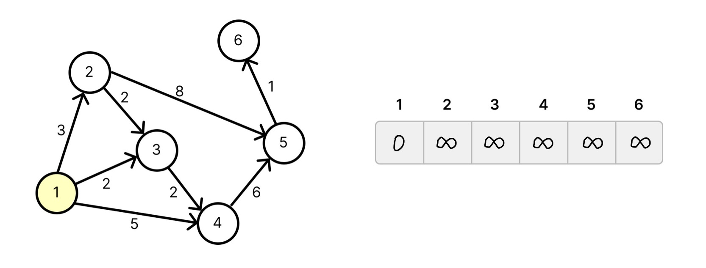
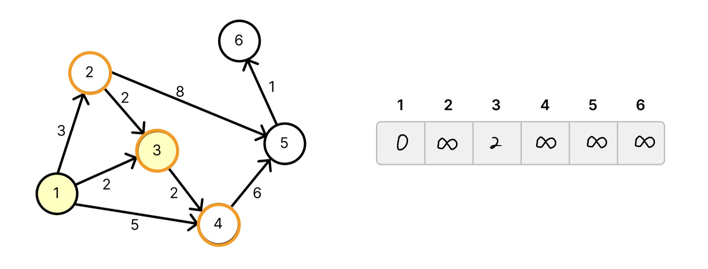
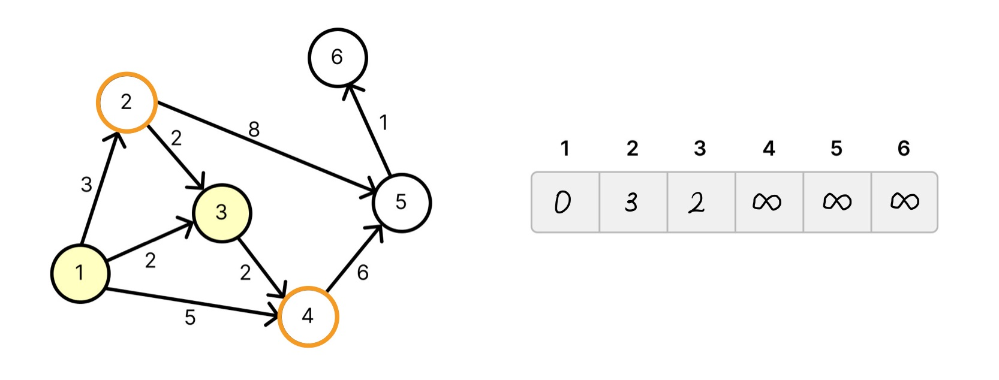
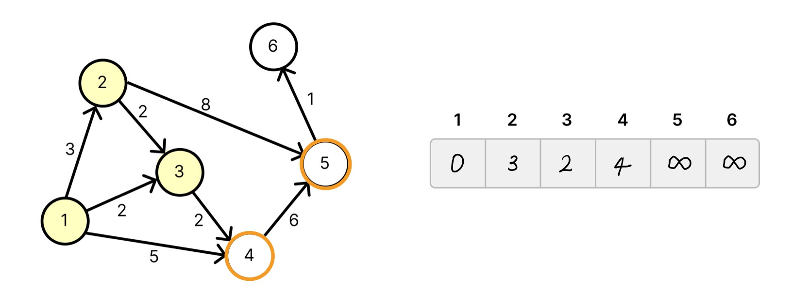
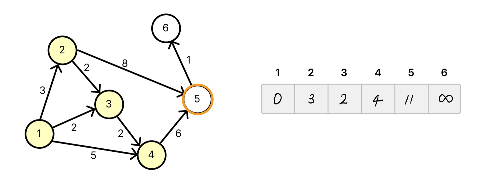
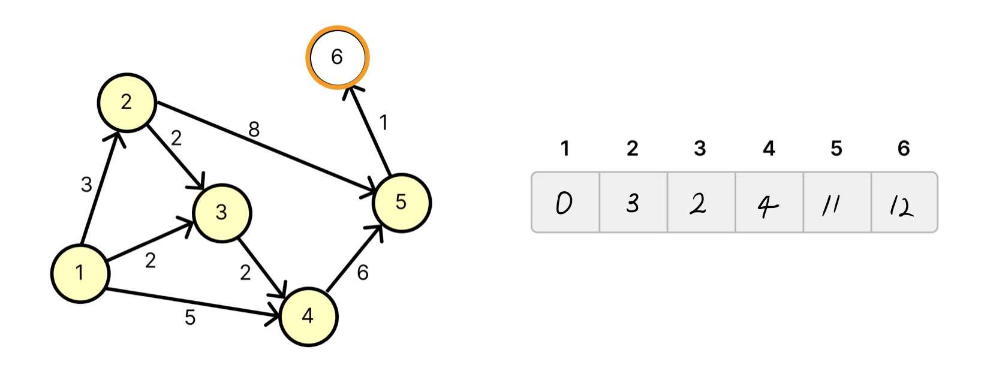

# Dijkstra 다익스트라 알고리즘 

> 하나의 시작점으로 부터 다른 __모든 정점까지의 최단 거리__ 를 구하는 알고리즘 

* 플루이드 알고리즘과 다른 점은 하나의 간선이라도 가중치가 음수인 간선이 있으면 사용할 수 없음. 
* 또한 플로이드 알고리즘은 모든 정점 쌍 사이의 최단 거리를 구하는 반면 다익스트라는 하나의 시작점으로 부터 다른 모든 정점까지의 최단거리를 구하는 알고리즘.
* 음수가 있을 때에는 벨만포드를 사용해야함. 

알고리즘은 현재 갈 수있는 정점들의 거리중 가장 짧은 것을 확정하는 것을 반복하여 구현한다. 이는 음수간선이 없다는 특징이 보장해주는 알고리즘이다. 

## Naive Dijkstra 









왜 이것이 보장될까? 음수간선이 없다는 조건이 있기 때문이다. 만약 3번정점을 2로 확정하는 과정에서 귀류법으로 다른 정점을 거쳐가는게 더 빠르다고 가정해보고 생각해본다면 알 수 있다. 1번이 갈 수 있는 간선중 가장 짧은 것이 3이기 때문에 음수간선이 없다는 가정에서 그 어느것도 2보다 빠를 수 없다. 

시간복잡도는 O(V^2+E)

## 최적화 Dijkstra

```py
import sys
import heapq as hq

INF = 111111111 # 가중치들의 앞이 INF를 넘어갈 수 있다 설정에 주의

v,e = map(int, sys.stdin.readline().split())
dists = [INF for _ in range(v+1)]
start = int(sys.stdin.readline())
q = []

graph = {} 
for i in range(1,v+1): 
    graph[i] = []
for i in range(e):
    s,e,w = map(int, sys.stdin.readline().split())
    graph[s].append((w,e))

def dijkstra(start): 
    dists[start] = 0 # 자기 자신의 거리는 0
    
    # 우선순위 큐에 (0,시작점을 추가)
    q.append((0,start))

    # 큐가 빌때까지 2,3번 과정을 반복
    while q: 
        item = hq.heappop(q) # 거리 가장 작은 원소 택
        w = item[0]
        v = item[1]

        # 해당거리가 최단 거리 테이블에 있는 값과 다를 경우 다음 과정을 수행하지 않고 넘어감
        if w != dists[v]: 
            continue

        # 원소가 가르키는 정점이 v 라 할때   
        for tp in graph[v]: # v와 이웃한 정점들(tpv)에 대해
            tpw = tp[0]
            tpv = tp[1]
            if dists[tpv] > dists[v] + tpw: # 최단 거리 테이블 값보다 v를 거쳐가는 것이 더 작은 값을 가질 경우
                dists[tpv] = dists[v] + tpw # 최단 거리 테이블의 값을 갱신하고 
                hq.heappush(q, (dists[tpv],tpv)) # 우선순위 큐에 (거리, 이웃한 정점의 번호)를 추가

dijkstra(start)

for i in range(1,v+1): 
    if dists[i] == INF:
        print('INF')
    else:
        print(dists[i])
```
시간복잡도는 O(ElogE)

대부분의 경우 V가 E보다 적기 때문에 최적화된 다익스트라를 사용하는 것이 좋다. 