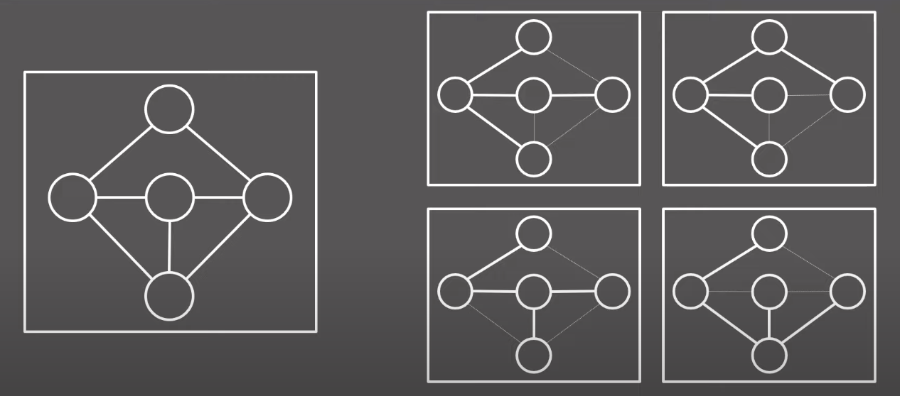

# 최소 신장 트리  

신장트리란 위와 같이 어떤 그래프의 부분 그래프 중 사이클이 없이 모든 노드가 연결된 그래프를 말한다.

이때 각 간선들에 가중치가 있다면 모든 간선들의 가중치를 더하였을때 가장 작은 값을 가지는 신장트리를 최소신장트리라고 부른다. 

## 크루스칼 알고리즘 
매회 모든 연결된 간선 중 가장 짧은 간선만을 채택하여 노드들을 하나의 그룹으로 이어가는 방식으로 구현. 

이때 __노드들이 같은 그룹에 속해있는지 여부를 판단__ 하는 것이 키포인트.

위 과정을 최적화하는데 사용할 수 있는 것이 __Union Find__ 이다.

## 코드 
```py
# 백준 1197 번 풀이 중
for edge in edges: 
    w,v1,v2 = edge
    if is_same_group(v1,v2):
        continue
    dist += w
    cnt += 1
    if cnt == v-1:
        break
```

위 중 is_same_group을 어떻게 작성하느냐에 따라 시간복잡도에서 차이를 보인다. 

만약 매회 모든 노드를 반복하며 같은 그룹인지 확인하는 방법을 사용하게 된다면 O(ElogE + VE) 만큼 걸리게 된다. (ElogE는 정렬)

그러나 여기서 유니온 파인드를 사용하면 사실상 상수시간에 같은 그룹인지 여부를 판단할 수 있고 최종적으로 O(ElogE)에 알고리즘을 구현할 수 있다.