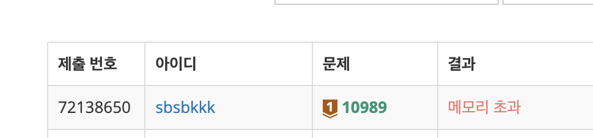

# 정렬

## 정렬의 종류
### Selection Sort, 선택 정렬
배열의 길이만큼 반복하며 데이터 중 가장 작은 값의 데이터를 선택하여 앞으로 보내는 정렬.  

선택 정렬의 시간 복잡도는 O(N²)이며 Worst, Average, Best 모두 동일.

### Insertion Sort, 삽입 정렬
데이터를 순서대로 뽑아서 적절한 위치를 찾아 삽입함으로써 완성하는 정렬.  

삽입 정렬의 시간 복잡도는 O(N²)이며 Worst, Average는 동일하고 이미 정렬되어 있는 Best의 경우 O(N). 무조건 위치를 변경하는 선택 정렬과 시간 복잡도가 같지만 필요할 때에 삽입한다는 점에서 연산수가 적어지므로 효율적. 이미 정렬되어 있는 데이터가 많다면 빠른 알고리즘.

### Bubble Sort, 버블 정렬
버블 정렬은 버블이 수면 위를 올라오는 듯 옆에 있는 데이터와 비교하여 더 작은 값을 앞으로 보내는 정렬.  

버블 정렬의 시간 복잡도는 O(N²)이며 Worst, Average, Best 모두 동일. 앞서 소개한 선택 정렬, 삽입 정렬과 시간 복잡도가 같지만 연산 수가 많아 정렬 알고리즘 중에서 가장 느리고 효율성이 떨어지는 정렬 방식.

### Merge Sort, 합병 정렬(또는 병합 정렬)
합병 정렬은 비교 기반 알고리즘으로 '분할, 정렬, 결합'순으로 진행되는데 데이터 배열을 2개 이상의 부분 배열로 분할하고 부분 배열에서 정렬을 한 뒤 결합하며 정렬을 수행.

합병 정렬의 시간 복잡도는 O(N ㏒ N)이며 Worst, Average, Best 모두 동일합니다. 데이터를 정확히 반으로 나누고 정렬하기 때문에 항상 일정한 시간 복잡도를 유지하므로 퀵 정렬의 한계점을 보완할 수 있는 장점이 있지만 다른 알고리즘과 비교했을 때 O(n) 수준의 메모리가 추가로 필요하다는 단점이 있음.

```py
def merge_sort(arr):
    if len(arr) > 1:
        mid = len(arr) // 2
        left_half = arr[:mid]
        right_half = arr[mid:]

        # 왼쪽과 오른쪽 부분 배열을 재귀적으로 정렬
        merge_sort(left_half)
        merge_sort(right_half)

        i, j, k = 0, 0, 0

        # 두 개의 부분 배열을 합병
        while i < len(left_half) and j < len(right_half):
            if left_half[i] < right_half[j]:
                arr[k] = left_half[i]
                i += 1
            else:
                arr[k] = right_half[j]
                j += 1
            k += 1

        # 남은 원소들을 복사
        while i < len(left_half):
            arr[k] = left_half[i]
            i += 1
            k += 1

        while j < len(right_half):
            arr[k] = right_half[j]
            j += 1
            k += 1
```


### Quick Sort, 퀵 정렬
퀵 정렬은 데이터 중 임의의 기준값을 정해서 두 부분 집합으로 나눔. 이때의 기준 값을 피벗(Pivot)이라고 하고 왼쪽은 피벗보다 작은 값, 오른쪽은 피벗보다 큰 값을 배치하고 더 이상 집합을 나눌 수 없을 때까지 재귀적으로 실행.

퀵 정렬의 시간 복잡도는 O(N ㏒ N)이며 Average, Best는 동일하고 Worst의 경우 O(N²). 삽입 정렬과 반대로 퀵 정렬은 이미 정렬된 데이터라면 매우 비효율적으로 작용.

### Heap Sort, 힙 정렬 

힙 정렬은 이진트리 기반의 트리형 자료구조로써 최솟값이나 최댓값을 찾아내기 위해서 사용. 내림차순 정렬을 위해서는 최대 힙, 오름차순 정렬을 위해서는 최소 힙을 구성하면 됨.

힙 정렬의 시간 복잡도는 O(N ㏒ N)이며 Worst, Average, Best 모두 동일. 완전 이진트리를 사용.

### Radix Sort, 기수정렬
데이터를 구성하는 기본 요소 (Radix) 를 이용하여 정렬을 진행하는 방식

입력 데이터의 최대값에 따라서 Counting Sort의 비효율성을 개선하기 위해서, Radix Sort를 사용할 수 있음.

자릿수의 값 별로 (예) 둘째 자리, 첫째 자리) 정렬을 하므로, 나올 수 있는 값의 최대 사이즈는 9임 (범위 : 0 ~ 9)

시간 복잡도 : O(d * (n + b))

-> d는 정렬할 숫자의 자릿수, b는 10 (k와 같으나 10으로 고정되어 있다.)

( Counting Sort의 경우 : O(n + k) 로 배열의 최댓값 k에 영향을 받음 )

장점 : 문자열, 정수 정렬 가능

단점 : 자릿수가 없는 것은 정렬할 수 없음. (부동 소숫점)

중간 결과를 저장할 bucket 공간이 필요함.




```py
def radix_sort(arr):
    # 가장 큰 숫자의 자릿수를 찾는다.
    max_num = max(arr)
    max_digits = len(str(max_num))

    # 각 자릿수에 대해 radix sort 수행
    for digit in range(max_digits):
        arr = sort(arr, digit)
    
    return arr

def sort(arr, digit):
    n = len(arr)
    output = [0] * n

    # 현재 자릿수에 따라 버킷 생성
    buckets = [[] for _ in range(10)]

    # 현재 자릿수에 따라 각 숫자를 버킷에 할당
    for i in range(n):
        index = arr[i] // (10 ** digit)
        buckets[index % 10].append(arr[i])

    # 버킷에 있는 숫자를 순서대로 output 배열에 병합
    output_index = 0
    for bucket in buckets:
        for num in bucket:
            output[output_index] = num
            output_index += 1

    return output


```

## 생각해볼 점
> 그럼 퀵 정렬은 언제나 가장 빠른가? NO

퀵정렬은 가장 빠른 알고리즘 중 하나지만 이미 정렬된 데이터의 경우 퀵 정렬보다 삽입 정렬을 사용하는 것이 더 빠르고 효율적임. 이처럼 상황에 따라 효율적인 알고리즘은 다르다는 것이 핵심.

"A 알고리즘과 B 알고리즘의 시간복잡도를 비교해주세요"  
"A 알고리즘은 최소 aa 최대 bb 이며 B 알고리즘은 최소 cc 최대 dd입니다"   
"그럼 A 알고리즘은 언제나 B 알고리즘보다 빠를까요?"  
"아닙니다. 데이터의 개수에 따라서 다릅니다."   
"그럼 n개의 데이터를 가진 프로그램이 있다고 가정해봅시다. 어떤 알고리즘을 사용하는게 좋을까요"   
"데이터의 개수가 크므로 A 알고리즘을 사용하겠습니다."   
"~~한 경우는 어떻게 할까요."   
"그럼 데이터에 한계치를 두어 x이하는 B알고리즘을, 이상은 A알고리즘을 사용하겠습니다"  