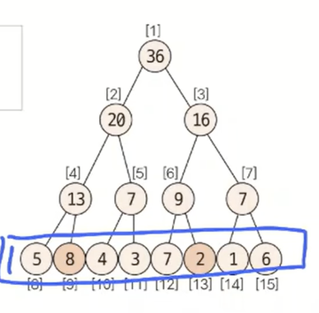

# 트리 Tree 
>  그래프의 일종으로, 한 노드에서 시작해서 다른 정점들을 순회하여 자기 자신에게 돌아오는 순환이 없는 연결 그래프. 

트리 자료구조는 조건이 좀더 빡센 자료구조라고 생각하면 된다. 
1. 방향이 없고 
2. 루트(최상위 노드)라는 개념이 존재하며 
3. 노드별로 부모 및 자식이라는 개념을 사용하여 파생해나가는 형태이며
4. 부모/자식 패러다임으로 인해 계층구조가 생긴다. 

자료구조의 형태가 특이하다보니 여러 조건 들을 더 둠으로 또 다른 자료구조들이 파생될 수 있다. 
* 자식을 두가지만 가질 수 있도록 하면 binary 트리 라고 부르며 모든 노드가 항상 자식을 모두 가지고 있을 때 완전이진트리라고 부른다. 
* 또한 데이터를 저장하는 방식에 따라 구분하는 경우도 있는데 Trie 자료구조와 세그먼트 트리가 대표적인 예이다.

## 순회 
트리는 계층구조로 이루어져있기 때문에 각 노드들을 어떻게 방문하는지가 중요하다. 특히 자기 자신을 방문하는 순서에 따라 3가지로 나누어진다. 아래는 이진 트리를 기준으로 작성되었다.
1. __전위순회__: 자신을 먼저 방문하고 왼쪽부터 방문을 이어감. 
    ```py
    def preorder(lc, rc, cur):
    print(chr(cur+ TO_INT), end = '')
    if lc[cur] != 0: preorder(lc,rc,lc[cur])
    if rc[cur] != 0: preorder(lc,rc,rc[cur])
    ```
2. __중위순회__: 왼쪽을 먼저 방문하고 자신을 방문 후 오른쪽을 방문한다.
    ```py
    def inorder(lc, rc, cur):
    if lc[cur] != 0: inorder(lc,rc,lc[cur])
    print(chr(cur+ TO_INT), end = '')
    if rc[cur] != 0: inorder(lc,rc,rc[cur])
    ```
3. __후위순회__: 왼쪽, 오른쪽을 모두 방문하고 자신을 방문한다. 
    ```py
    def postorder(lc, rc, cur):
    if lc[cur] != 0: postorder(lc,rc,lc[cur])
    if rc[cur] != 0: postorder(lc,rc,rc[cur])
    print(chr(cur+ TO_INT), end = '')
    ```
4. __레벨 순서 순회__: 계층 순서대로 방문한다. 
위 순회 중 전위 순회는 DFS, 레벨 순서 순회는 BFS와 동일하게 작동된다는 것을 기억하자. 

## 세그먼트 트리 
구간 합을 구하기 위해 고안된 특수한 트리의 형태이다. 이전까지 우리는 구간합을 구할 때 앞에서 부터 순서대로 미리 누적합을 계산하여 저장한 누적합배열을 사용하였다. 그러나 이 배열은 데이터의 변경이 있을때 마다 합배열을 매번 다시 계산해줘야한다는 치명적 단점이 있다. 세그먼트 트리는 이 단점을 구간합 계산, 데이터 변경 모두 매회 __O(logN) 번__ 에 변경할 수 있도록 만들어준다. 

아래에는 __배열을 사용한 세그먼트 트리__ 를 구현하는 방법을 설명한다. 

### 초기화 하기 
먼저 데이터의 개수를 기반으로 트리배열의 크기를 결정한다. 포인트는 __데이터의 개수를 넘는 최소의 2의 제곱수 곱하기 2__ 로 초기화 하는 것. 예를 들어 데이터의 개수가 5개라면 5를 넘는 최소 제곱수는 8 이므로 16으로 초기화 한다. 이유는 모든 데이터를 맨 아래줄, 리프노드에 순서대로 저장하기 위함이다. 

그 후 리프노드들로부터 시작하여 각 계층별 부모들의 값을 자식의 합으로 초기화한다. 모든 작업후에는 최종적으로 루트노드에는 전구간 데이터 합이 저장된다.

### 구간합 구하기 
초기화된 트리의 구간합을 구하는 로직은 조금은 생소하다. 
1. start_index % 2 == 1 일때 해당노드를 선택
2. end_index % 2 == 0 일때 해당노드를 선택 
3. start_index depth 변경: start_index = (start_index + 1) / 2 연산으로 부모이동 
4. end_index depth 변경: end_index = (end_index - 1) / 2 연산으로 부모이동
5. 1 ~ 4를 반복하다가 end_index < start_index가 되면 종료. 



여기서 start와 end 가 선택되는 이유가 중요한다. 우리는 매번 단계마다 부모의 범위를 넘어가는 노드가 있는지 체크한다. 그리고 그 노드를 선택하여 정답값에 반영한다. 그리고 start에는 - 1 end에는 + 1을 하는 이유도 동일하다. 해당 노드가 범위를 벗어나든 아니든 적절한 부모로 올라가게 된다. 

### 데이터 수정
데이터 수정은 매우 간단하다. 적절한 인덱스를 찾고 해당 값을 수정하면 부모노드를 하나씩 타고 올라가며 수정해주면된다. 

## Trie
문자열을 효율적으로 처리하기 위한 자료구조


* 장점:  단어 S를 삽입/탐색/삭제할 때 O(|S|) (단어의 개수)
* 단점: 문자열을 그냥 배열에 저장하는 것 보다 최대 '글자의 종류'배 만큼 더 사용

이론적인 시간복잡도와는 별개로 실제로는 트라이가 해시, 이진 검색 트리에 비해 훨씬 느림. 일반적인 상황에서는 해시나 이진 검색 트리를 사용하는게 좋으나 트라이의 성질을 사용해야 하는 문제가 여럿 존재

### 정말 빠른가?


실제로 공간복잡도만 보아도 엄청난 차이가 난다. 각 노드마다 단순 계산으로 26배의 메모리를 잡아야하기 때문. 실제로는 약 65배 만큼도 차이가 난다. 

시간이 차이나는 이유는 기본적으로 메모리의 접근은 단순 연산보다 속도가 느리기 때문이다. 트라이에서는 정점을 정직하게 글자의 크기만큼 이동하고 이를 굉장히 큰 배열(혹은 리스트)에서 이동하게 되므로 cache hit rate가 굉장히 나쁘다. 반면 이진 검색 트리나 해시에서는 트라이와 달리 정점의 이동이 그렇게 많지 않고, 두 문자열의 비교를 매 글자마다 하는 트라이에 비해 연산에 의해 한번에 마무리하는 두 알고리즘이 상대적으로 빠를 수 밖에 없다. 

메모리에서도 물론 1바이트를 차지하는 char 자료형만을 사용하는 두 알고리즘에 비해 자식 정보를 저장할때 4바이트의 integer를 사용하여 저장하므로 4*글자의 종류 만큼 많이 차지하게 되는 것.

이렇게 이론과는 다르게 시간,공간복잡도에서 손해를 많이 보는 구조이긴하지만 해당 특징을 활용할 수 있는 곳에서 유용하다. 대표적으로 검색 자동완성과 같은 기능이 있다. 한글자씩 비교하며 연관 단어들을 출력해주는 검색자동완성 기능을 떠올려보자. 