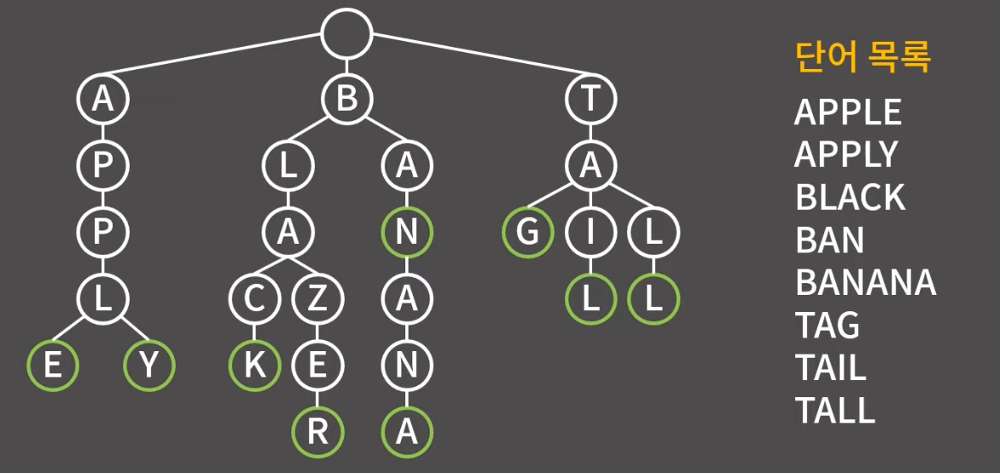
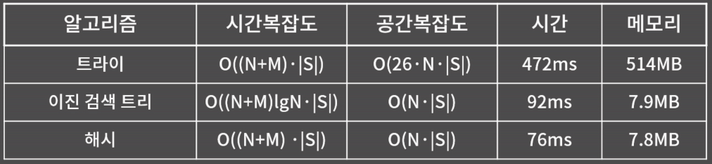

# 트리 Tree 

## Trie
문자열을 효율적으로 처리하기 위한 자료구조

* 장점:  단어 S를 삽입/탐색/삭제할 때 O(|S|) (단어의 개수)
* 단점: 문자열을 그냥 배열에 저장하는 것 보다 최대 '글자의 종류'배 만큼 더 사용

이론적인 시간복잡도와는 별개로 실제로는 트라이가 해시, 이진 검색 트리에 비해 훨씬 느림. 일반적인 상황에서는 해시나 이진 검색 트리를 사용하는게 좋으나 트라이의 성질을 사용해야 하는 문제가 여럿 존재

### 정말 빠른가?

실제로 공간복잡도만 보아도 엄청난 차이가 난다. 각 노드마다 단순 계산으로 26배의 메모리를 잡아야하기 때문. 실제로는 약 65배 만큼도 차이가 난다. 

시간이 차이나는 이유는 기본적으로 메모리의 접근은 단순 연산보다 속도가 느리기 때문이다. 트라이에서는 정점을 정직하게 글자의 크기만큼 이동하고 이를 굉장히 큰 배열(혹은 리스트)에서 이동하게 되므로 cache hit rate가 굉장히 나쁘다. 반면 이진 검색 트리나 해시에서는 트라이와 달리 정점의 이동이 그렇게 많지 않고, 두 문자열의 비교를 매 글자마다 하는 트라이에 비해 연산에 의해 한번에 마무리하는 두 알고리즘이 상대적으로 빠를 수 밖에 없다. 

메모리에서도 물론 1바이트를 차지하는 char 자료형만을 사용하는 두 알고리즘에 비해 자식 정보를 저장할때 4바이트의 integer를 사용하여 저장하므로 4*글자의 종류 만큼 많이 차지하게 되는 것.

이렇게 이론과는 다르게 시간,공간복잡도에서 손해를 많이 보는 구조이긴하지만 해당 특징을 활용할 수 있는 곳에서 유용하다. 대표적으로 검색 자동완성과 같은 기능이 있다. 한글자씩 비교하며 연관 단어들을 출력해주는 검색자동완성 기능을 떠올려보자. 