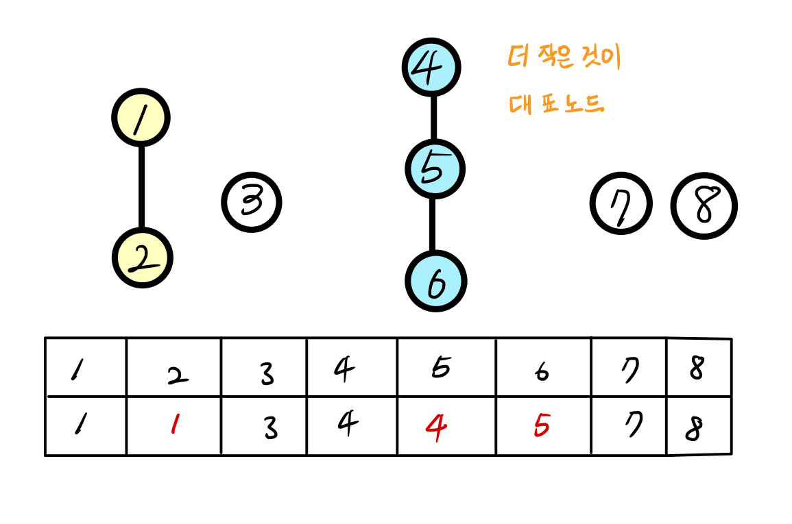

# 유니온 파인드

* 그래프 알고리즘으로 두 노드가 같은 그래프에 속하는지 판별하는 알고리즘.
* 서로소 집합, 상호 베타적 집합(Disjoint-Set)으로도 불린다.
* 노드를 합치는 Union연산과 노드의 루트 노드를 찾는 Find연산으로 이루어진다.
* 트리 구조로 이루어진 자료구조 중 한가지로 생각되기도 한다.
* 주로 1차원 배열로 구현한다.

## 유니온 연산

위와 같은 8개의 단절 노드가 있을때 각자 자신의 대표 노드가 자기 자신이라는 의미로 자기 자신의 값을 가진다. 

이때 1과 2을 합치고 4,5,6을 합친다면 

위와같이 해당 노드의 대표노드를 변경해주면 된다. 이때 숫자가 더 작은 것을 대표노드로 설정해주는 규칙을 정해놓으면 위 같은 결과를 얻는다. 

## 파인드 연산 

find연산은 간단하다. 위 같이 찾기 원하는 노드의 대표노드를 인덱스 삼아 자기 자신을 대표노드로 가지는 노드를 찾을 때 까지 반복한다. 

파인드연산에서는 찾는 과정의 깊이를 줄이기 위한 특별한 행위를 하게 되는데.
재귀를 빠져나올때 전 모든 노드들의 대표노드를 파인드의 결과로 바꿔준다. 

이렇게 되면 다음 연산의 find에서 대표노드를 1단계 만에 찾을 수 있다. 이것이 유효한 것은 유니온 파인드의 목적이 연결되어 있는가에 있기때문에 같은 집합에 속해있는지만 확인하는게 중요하기 때문이다. 

따라서 최종적으로 유니온 연산을 할때는 합치기 원하는 두 노드의 대표노드를 먼저 찾고 그 결과로 이어주어야 한다. 